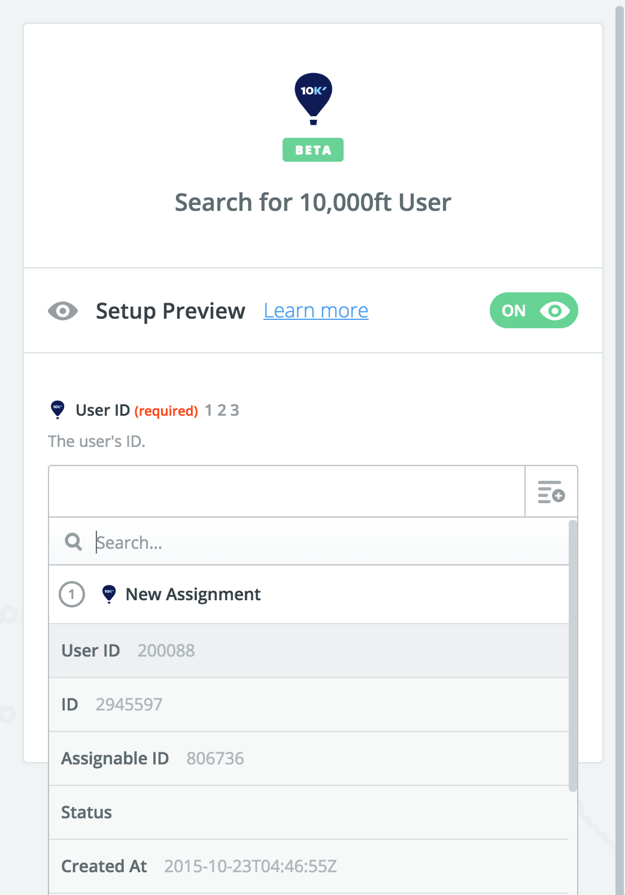
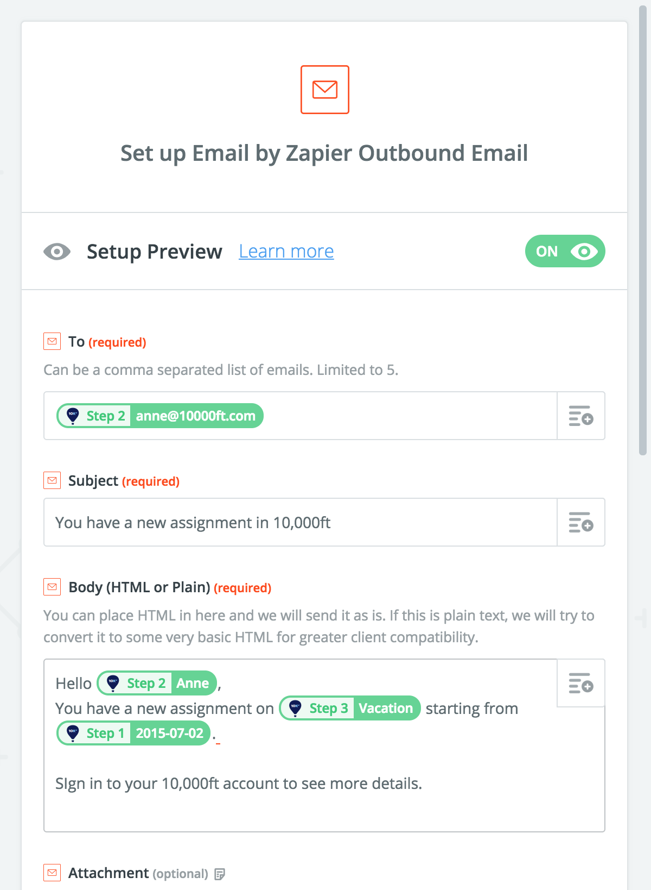
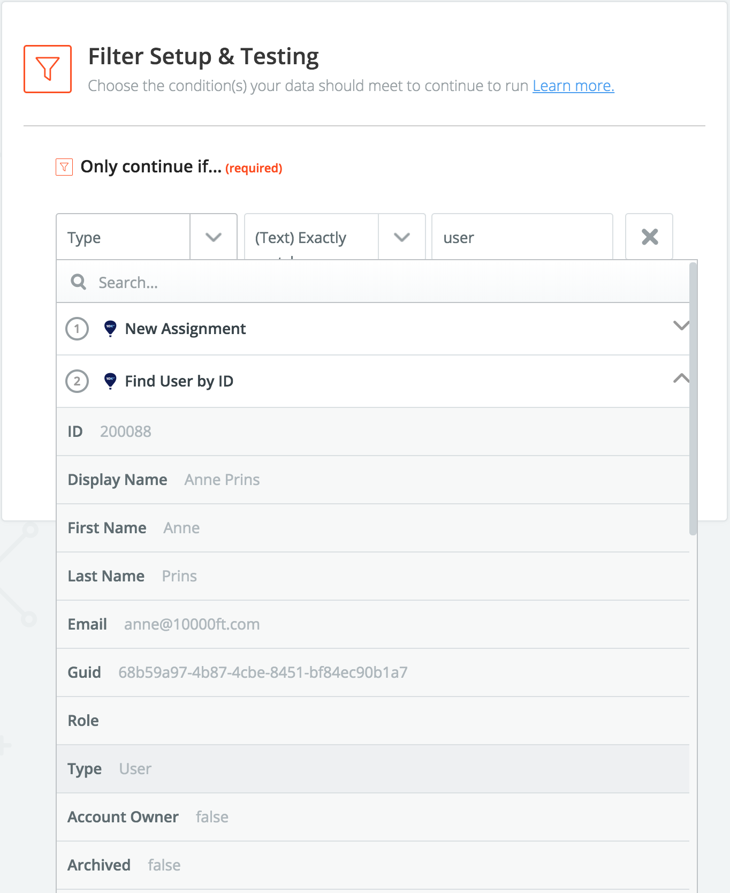

# 10,000ft Zapier Integration

Zapier is a web automation service that lets you integrate 10,000ft with thousands of other apps. You can read more details on the 10,000ft + Zapier [integrations page](https://zapier.com/apps/10000ft/integrations). 

## Requirements

* A 10,000ft account 
  * A 10,000ft API Token accessible via settings in your account
* A Zapier account
* Optionally, an account with each service that will be connected with 10,000ft via Zapier

Zapier provides free and paid plans. See the [Zapier pricing page](https://zapier.com/app/pricing) for more info.

## Connecting 10,000ft with Zapier

  * This step is only required when connecting 10,000ft with your Zapier account for the first time
  * Start by making a new Zap in your Zapier account
  * Find the 10,000ft app and pick any trigger to initiate the setup
  * When prompted, add the 10,000ft API Token into Zapier, test and save your connection
    
    
  
Once the connection is setup and tested, you can use it to make new Zap. Lets go through the steps and setup an example Zap.

## Configuring a Zap

Configuring a 10,000ft Zap typically involves,

* Connecting your 10,000ft account with Zapier
* Selecting a 10,000ft trigger
* Optionally, configure one or more Search steps to look up additional details
  * 10,000ft Triggers typically return user or assignable IDs
  * We provide find actions so you can get additional details (e.g. a user's email address) given their ID
  * This allows you to combine attributes you get from the trigger with additional attributes you get via searching to create Zaps that are rich in details and provide higher value.
* Choosing an app to connect with (e.g. Email)
* Configure, test and enable your Zap

## Example: Send an email when a new assignment is made in 10,000ft

Lets try a specific example. In the steps below we will make a Zap that will send an email to when one of your team members are assigned to a project. When you are done, this is what the outline of your Zap will look like,

  

And here are the steps in detail,

* Sign in to your Zapier account
* Start a Zap
* Search for the 10,000ft app and select it
* Select a 10,000ft Trigger (e.g. New Assignment)
  
  

* Connect your 10,000ft app if prompted by supplying your 10,000ft API token
* Add a step to search 10,000ft and lookup details for the user_id in the assignment
  
  

  * Add a step and select 10,000ft as the app
  * Search and select the `Find User by ID` action
  * Configure it to find the user for the `user_id` from the New Assignment trigger we setup above
  
* Add a step to search 10,000ft and lookup details for the assignable_id in the assignment
  * Add a step and select 10,000ft as the app
  * Search and select the `Find Assignable by ID` action
  * Configure it to find the assignable for the `assignable_id` from the New Assignment trigger we setup above
* Add a step to send an email
  
  

  * Select the Email by Zapier app
  * Configure it to send an email to user in the New Assignment
  * When you are done, the email template will look like this,
  
* Test and enable your Zap.

Now, when a new assignment is made on the 10,000ft schedule, the person who was assigned will be sent an email with the name of the Project (or Leave) that they were assigned to and the start date of that assignment.

## Fiters & additional considerations

Zapier Filters are useful when building integrations with 10,000ft. You can use any attribute from a trigger of search action when implementing a filter. The `Type` attribute available in 10,000ft users and assignabled are particularly useful. For example, in the example above your Zap would typically exclude Placeholder users. This would be implemented by adding a FIlter to you Zap as shown below.

  

Familiarize yourself with the different types of users and assignables available in 10,000ft when designing your 10,000ft Zaps so you can get the result you are trying to achive with your integration. Contact 10,000ft support with any questions.

## Triggers

10,000ft provides the following Triggers

* **New Assignment** Triggers when a new assignment is created.
* **New User** Triggers when a new user is created.
* **New Project** Triggers when a new project gets created.
* **New Time Entry** Triggers when a new time entry is created.
* **Assignment Updated** Triggers when an assignment is updated.
* **User Updated** Triggers when a new user is updated.
* **Project Updated** Triggers when a project gets updated.
* **Time Entry Updated** Triggers when a new time entry is updated.

## Actions

10,000ft provides the following actions for creating or updating information in your 10,000ft account via Zapier

* **Create Project** Create a new project.
* **Create User** Create a new team member.
* **Create Time Entry** Create a new time entry.
* **Update Project** Updates a project.
* **Update User** Updates a team member.
* **Update Time Entry** Update a time entry.

## Searches

* **Find Assignable by ID** Finds an existing assignable by the assignable's ID. An assignable is anything that can be assigned to a user such as a Project or Leave type.
* **Find Project by ID** Finds an existing project using the project's ID.
* **Find User by ID** Finds an existing user by their ID.
* **Find User by Email** Finds an existing user by their email.
* **Find User by Name** Finds an existing user by their name.
* **Find Assignable by Name** Finds an existing assignable by name.
* **Find Project by Name** Finds an existing project by name.

